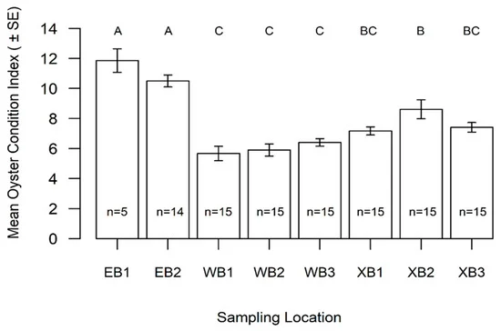
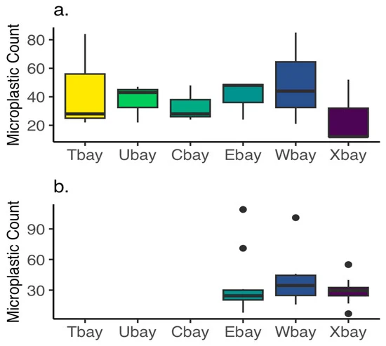
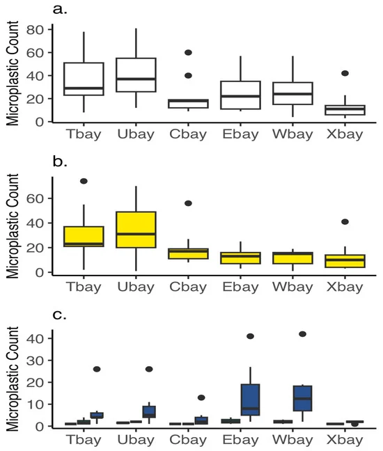
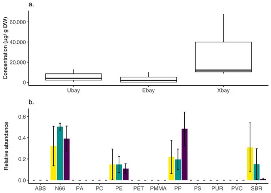

# Data Analysis Replication Project

## 1. 0 - Introduction

This project aims to replicate the analysis done in Ciesielski *et al*., 2025 (<https://doi.org/10.3390/jmse13112065>). The original paper aims to examine spatial differences in micro- and nano- plastic composition in selectively-filtering oysters and subsequently colonized water ways. Micro- and nano- plastics are becoming of rising concern in public health fields as environmental presence is becoming more apparent as well as potential bioaccumulative properties.

Oysters, a large industry in the Gulf region, particularly the Texas coast, are selective filter feeders capable of consuming particular material and expelling other matter via pseudo-feces. Significant questions have been raised as 1) Texas coastal waters, due to physical oceanographic processes, have higher concentrations compared to other global coastal regions and 2) oysters have been shown to selectively filter certain plastics from the waters they are inhabitating leading to interesting relationships between plastic concentrations in and out of oysters.

#### 1.1 - Analyses Conducted

This study uses three separate methods of analysis in order to determine oyster health and plastic chemistry/quantity in sites across Galveston Bay, a major industrial region.

1.  Condition Index: a measure of health for oysters that examines soft tissue to overall size.

    1.  This was accomplished by shucking the oyster, drying the meat, and measuring followed by a calculation of the internal shell cavity volume (difference in weight between the whole oyster and the weight of the dried empty shell.

        Formula:

        $$
        CI = dry meat weight (g)/ internal shell cavity volume (cm^3
        ) * 100$$

    2.  Microplastic Analysis with an Olympus DP27 stereo microscope and camera.

        1.  Water and oyster samples were filtered to capture suspected plastic particles.

        2.  Each particle was categorized by color and type (e.g. fiber, fragment, film, sphere).

        3.  A randomized subset of samples containing 10% of all particles were chosen using a random number table and imaged under microscopy.

        4.  The longest length was measured and the subsequent mass was calculated using average density and diameter.

        5.  From here, measurements of oysters were incorporated to estimate overall concentration of particles per oyster, finding it to be 8% of total oyster mass.

    3.  Microplastic Analysis with Spectroscopy

        1.  attenuated total reflectance-Fourier-transform infared (ATR-FTIR) spectroscopy.

            1.  Microplastic characterization using ATR-FTIR spectra to examine general concentrations present in each sample site.

        2.  pyrolysis-gas chromatography-mass spectrometry with tandem mass (Py-GCMS/MS) spectrometry.

            1.  Measures specific mass per particle per sample.

For this project, the analysis will include the replication of [**water quality table**]{.underline} (Table 2, *descriptive statistical analysis*), [**oyster condition index comparison**]{.underline} (Figure 2, *inferential statistical analysis*), [**microplastic count via microscopy**]{.underline} (Figure 3 & 4, *visualization*), and [**chemical composition and abundance via PyGCMS/MS**]{.underline} (Figure 7, *descriptive statistics and visualization*).

#### 1.2 - Data Collection and Utilization

Samples were taken from six total sites broken down as the following:

-   Christmas Bay (Xbay): surface water collection & oysters collected for CI measurements and chemical analysis of microplastics

-   West Bay (Wbay): surface water collection & oysters collected for CI measurements

-   East Bay (Ebay): surface water collection & oysters collected for CI measurements and chemical analysis of microplastics

-   Dickinson/Central Bay (Cbay): water collection for chemical analysis & oysters collected for chemical analysis of microplastics

-   Kemah/Seabrook/Upper Bay (Ubay): water collection for chemical analysis

-   Trinity Bay (Tbay): surface water collection

#### 1.3 - Conclusions of the Original Study

Results find that water system carried primarily fibers and oysters had an order of magnitude higher of fiber particles that other microplastic particles. The highest abundance of color fragment was clear by large margins, followed by black and blue.

Chemical composition analyses found that surface waters contained higher volumes of polyamide and polypropylene were more common in upper regions of the bay while ethylene propylene and polyethylene terephthalate were more common in the lower regions of the bay. There appeared to be four distinct plastic types found across the bay: polypropylenem nylon 66m polyethylenem and stryene butadeiene, with polyethylene and styrene butadiene (rubber) making up \~20% of microplastic load in oyster samples. This supports previous hypotheses that oysters will selectively filter different plastic particles.

Condition Index of oysters found significant differences across sampled reefs with significantly higher oyster CI (theoretically healthier) in East Bay compared to West Bay and Christmas Bay.

#### 1.4 - Variable Dictionary

wq (2.2.1): original table for water quality data

base_d (2.3.0): oyster condition index table not containing any inferential statistics

snk_CI (2.3.1): tibble containing data from SNK post-hoc test that includes letters indicated significant difference

mp_counts (2.4.0): microplastic data from microscopy component containing all data from four different sample types (water blanks, oyster blanks, surface water, and oyster tissue)

mp_wb (2.4.1): microplastic data from water blanks from microscopy experiment

mp_ob(2.4.2): microplastic data from oyster blanks from microscopy experiment

mp_sw (2.4.3): all microplastic types from surface water samples from microscopy experiment

mpf_sw (2.4.3): fiber microplastic types from surface water samples from microscopy experiment

mpfff_sw (2.4.3): fragment, film, or fiber bundle microplastic types from surface water samples from microscopy experiment

PYGCMSMS (2.5.0): tibble containing data from PyGCMS/MS experiments containing 10 oyster samples with composition and abundance (ug)

site_obb (2.5.1): tibble mutated from PyGCMS/MS to calculate for body burden

Figure7a (2.5.2): tibble mutated from PyGCMS/MS to include total microplastic concentration (ug) for each oyster sample

mp_long (2.5.2): converting PYGCMSMS tibble from horizontal to vertical

mp_rel (2.5.2): mutating mp_long to include a column for relative abundance of microplastics per sample

## 2.0 - Data Analysis and Visualization Replications

### 2.1 - Preliminary

```{r}
#Adding necessary pacakges to my library
library(tidyverse)
library(ggplot2)
library(lme4)
library(skimr)
library(agricolae)
library(dplyr)
library(car) 
#Telling engine where to output all of the figures
knitr::opts_chunk$set(fig.path = "images/")
```

### 2.2 - Water Quality (Table 2)

```{r}
#Reading in water quality data from raw github file
wq <- read_csv("https://raw.githubusercontent.com/carly-dempsey04/data-analysis-replication/refs/heads/main/data/data_waterquality.csv")

#Creating a preliminary table with the data
Table2_prelim <- wq %>%
  group_by(Location) %>%
  summarise(
    sal_mean = mean(salinity, na.rm = TRUE),
    sal_sd = sd(salinity, na.rm = TRUE),
    temp_mean = mean(temp, na.rm = TRUE),
    temp_sd = sd(temp, na.rm = TRUE),
    DO_mean = mean(DO, na.rm = TRUE),
    DO_sd = sd(DO, na.rm = TRUE),
    depth_mean = mean(depth, na.rm = TRUE),
    depth_sd   = sd(depth, na.rm = TRUE)
  )
head(Table2_prelim)

#Creating a final table for the data
Table2 <- Table2_prelim %>%
  mutate(Salinity = paste0(round(sal_mean, 2), " ± ", round(sal_sd, 2)),
  Temperature = paste0(round(temp_mean, 2), " ± ", round(temp_sd, 2)),
  DO = paste0(round(DO_mean, 2), " ± ", round(DO_sd, 2)),
  Depth = paste0(round(depth_mean, 2), " ± ", round(depth_sd, 2))
  ) %>%
  select(Location, Salinity, Temperature, DO, Depth)
head(Table2)
##NOTE: dataset did not include Christmas Bay water quality collection, which is found on Table 2 of the original publication
```

[**Output Conclusion:**]{.underline}

Replication of table 2 that shows water conditions across the different locations as follows: Dickinson (Cbay), East Bay (Ebay), Kemah (Ubay), Trinity Bay (Tbay), West Bay (Wbay). Christmas Bay (Xbay) is included on the original publication and yet the excel files associated do not contain data from this location. This is likely due to Xbay being an embankment of East Bay leading the conditions to be combined. Although this is an understandable filing, it does complicate replication.

### 2.3 - Oyster Condition Index Across Sites

#### 2.3.0 - Preliminaries

```{r}
#Loading in my csv containing oyster condition index values
oysterci <- read_csv("https://raw.githubusercontent.com/carly-dempsey04/data-analysis-replication/refs/heads/main/data/data_CI.csv")

#Building the framework tibble for the analyses including mean CI & standard deviation all grouped by site location
base_d <- oysterci %>%
  group_by(Location) %>%
  summarise(mean_CI = mean(CI, na.rm = TRUE), se_CI = sd(CI, na.rm = TRUE) / sqrt(n()), n = n())
class(base_d) #double checking class for left joining
```

#### 2.3.1 - Oyster Conditions Index Values by Sampling Location (Figure 2)

```{r}
#Running my ANOVA followed by the Student-Newman-Keuls (snk) post-hoc test
(lm_CI <- lm(CI ~ Location, data = oysterci))
(anova_CI <- aov(CI ~ Location, data = oysterci))
(snk_CI <- SNK.test(anova_CI, "Location", group = TRUE))

#Pulling the values from the SNK post-hoc test 
snk_CI_letters <- snk_CI$groups %>%
  rownames_to_column("Location") %>%
  rename(letter = groups)
class(snk_CI_letters) #double checking class for left joining

#Finally using my joins - connecting my base data to the SNK post-hoc
Figure2 <- base_d %>%
  left_join(snk_CI_letters, by = "Location")
head(Figure2)

#THis better work - plotting according to figure 2
ggplot(Figure2, aes(x = Location, y = mean_CI)) +
  geom_col(fill = "pink") +
  geom_errorbar(aes(ymin = mean_CI - se_CI, ymax = mean_CI + se_CI),
    width = 0.2) +
  geom_text(aes(label = paste0(n)),
    vjust = 1.5,
    color = "#000080",
    position = "jitter",
    size = 4) +
  geom_text(aes(label = letter, y = mean_CI + se_CI + 0.05),
    size = 5,
    color = "#000080") +
  labs(x = "Sampling Location", y = "mean oyster condition index")
```

[**Comparing to the Publication Figure**]{.underline}

```{r}
#| out-width: "70%"

```

[**Output Conclusion:**]{.underline}

This boxplot, replicating Figure 2 of the original publication, contains the Oyster Condition Index values (mean & sd) from six sampled oyster reefs (two in Ebay, three in WBay, and three in XBay). Plot additional statistics (error bars, replicate number, and statistical difference) all match original publication results (but prettier colors). Values from ANOVA and SNK post-hoc match that of original publication.

### 2.4 - Microplastic Counts

#### 2.4.0 - Preliminaries

```{r}
#Loading in my csv that contains all the microplastic measurement information
mp_counts <- read_csv("https://raw.githubusercontent.com/carly-dempsey04/data-analysis-replication/refs/heads/main/data/data_MPmeasure.csv")
```

#### 2.4.1 - Microplastic Counts in Water Blanks (Figure 3a)

```{r}
#Creating a new tibble that filters for all water blank samples and creates a column for the amount of microplastic samples found based on each site region
mp_wb <- mp_counts %>%
  filter(Sample_type == "waterblank") %>%
  select(Region, Sample_ID) %>%
  group_by(Region, Sample_ID) %>%
  summarise(Microplastic_Count = n(), .groups = "drop")
head(mp_wb)

#Creating figure 3a
ggplot(mp_wb, aes(x = Region, y = log(Microplastic_Count), fill = Region)) +
  geom_boxplot(
    outlier.shape = 10,
    outlier.size = 4) +
  scale_fill_brewer(palette = "Set3") +  
  labs(
    title = "Microplastic Counts of Water Blanks by Region",
    x = "Site",
    y = "Microplastic Count per Sample") +
  theme_minimal()
```

[**Comparing to the Publication Figure**]{.underline}

```{r}
#| out-width: "70%"

```

[**Output Conclusions:**]{.underline}

Figure appears comparable to publication figure with the exception of site names due to differential data logging in public domain csv compared to publication. Median values, percentiles, and (no) outliers are all matched.

#### 2.4.2 - Microplastic Counts in Oyster Blanks (Figure 3b)

```{r}
#Creating a new tibble that filters for all oyster blank samples and creates a column for the amount of microplastic samples found based on each site region
mp_ob <- mp_counts %>%
  filter(Sample_type == "oysterblank", na.rm = TRUE) %>%
  select(Region, Sample_ID) %>%
  group_by(Region, Sample_ID) %>%
  summarise(Microplastic_Count = n(), .groups = "drop")
head(mp_ob)

#Creating figure 3b
ggplot(mp_ob, aes(x = Region, y = Microplastic_Count, fill = Region)) +
  geom_boxplot(
    outlier.shape = 10,
    outlier.size = 4) +
  scale_fill_brewer(palette = "Set3") +  
  labs(
    title = "Microplastic Counts of Oyster Blanks by Region",
    x = "Region",
    y = "Microplastic Count per Sample") +
  theme_minimal()
```

[**Comparing to the Publication Figure**]{.underline}

```{r}
#| out-width: "70%"

```

[**Output Conclusion:**]{.underline}

Due to NA site data for Tbay, Ubay, and Cbay in the publically available csv, the replicated figure does not have blank plots as the publication figure does, rather a NA region to represent lack of data. All three include same outlier representations and median bars in approximate location.

#### 2.4.3 - Microplastic Counts in Surface Water Samples

```{r}
#Creating a new tibble that filters for all surface water samples and creates a column for the amount of microplastic samples found based on each site region
mp_sw <- mp_counts %>%
  filter(Sample_type == "water", na.rm = TRUE) %>%
  select(Region, Sample_ID) %>%
  group_by(Region, Sample_ID) %>%
  summarise(Microplastic_Count = n(), .groups = "drop")
head(mp_sw)

#Creating figure 4a
ggplot(mp_sw, aes(x = Region, y = Microplastic_Count)) +
  geom_boxplot(
    outlier.shape = 10,
    outlier.size = 4) +
  labs(
    title = "Microplastic Counts of Surface Water Samples",
    y = "Microplastic Count") +
  theme_minimal()

##Creating a new tibble that filters for surface water samples and creates a column for the amount of fiber microplastic samples found based on each site region
mpf_sw <- mp_counts %>%
  filter(Sample_type == "water" & MP_category == "fiber") %>%
  select(Region, Sample_ID) %>%
  group_by(Region, Sample_ID) %>%
  summarise(Microplastic_Count = n(), .groups = "drop")
head(mpf_sw)

#Creating figure 4b
ggplot(mpf_sw, aes(x = Region, y = Microplastic_Count)) +
  geom_boxplot(
    fill = "yellow",
    outlier.shape = 10,
    outlier.size = 4) +
  labs(
    title = "Fiber MP Counts of Surface Water Samples",
    y = "Microplastic Count") +
  theme_minimal()

#Creating a new tibble that filters for surface water samples and creates a column for the amount of fragment, film, and fiber bundle microplastic samples found based on each site region
mpfff_sw <- mp_counts %>%
  filter(Sample_type == "water" & MP_category %in% c("fragment", "film", "fiber bundle")) %>%
  select(Region, Sample_ID) %>%
  group_by(Region, Sample_ID) %>%
  summarise(Microplastic_Count = n(), .groups = "drop")
head(mpfff_sw)

#Creating figure 4c
ggplot(mpfff_sw, aes(x = Region, y = Microplastic_Count, fill = MP_category)) +
  geom_boxplot(
    fill = "#000080",
    outlier.shape = 10,
    outlier.size = 4) +
  labs(
    title = "Fragment, Film, and Fiber Bundle Counts of Surface Water Samples",
    y = "Microplastic Count")
```

[**Comparing to the Publication Figure**]{.underline}

```{r}
#| out-width: "70%"

```

[**Output Conclusion:**]{.underline}

Figure 4a: In contrast to table 2, Ebay and Xbay are separated and some sites are labeled according to full title, resulting in a lack of consistency between data analyses. Besides this, outliers also appear to match sites from original publication figure.

Figure 4b: All factors (percentiles and outliers) are comparable to publication figure, besides the median value at Cbay/Dickinson.

Figure 4c: All factors (percentiles and outliers) are comparable to publication figure although formatting is different.

### 2.5 - Microplastic Chemical Concentration and Composition

#### 2.5.0 - Preliminaries

```{r}
#Loading in my csv that contains all the microplastic PGYCMS/MS information
PYGCMSMS <- read_csv("https://raw.githubusercontent.com/carly-dempsey04/data-analysis-replication/refs/heads/main/data/data_PyGCMSMS.csv")
```

#### 2.5.1 - Comparison of Oyster Body Burden by Field Site

```{r}
#Body Burden = MP(ug)/Dry Weight (g)
site_obb <- PYGCMSMS %>%
  mutate("ug" = PMMA + PP + PVC + PA + PC + N66 + PE + PET + ABS + PUR + RUBBER + PS) %>%
  group_by(Location) %>%
  select(Location, `Wet _weight_g`, ug)

site_obb <- summarise(
  site_obb,
  avg = mean(ug)) 
head(site_obb)
```

[**Output Conclusion:**]{.underline}

Average between site locations matches trend seen in original publication (Xbay \> Ubay \> Ebay) although still difficult to compare given different site names in csv file.

#### 2.5.2 - Concentration and Relative Abundance of Microplastics from Py-GCMS/MS

```{r}
##Creating a  tibble that includes location, dry weight (g), and chemical concentrations tested and creating a new column that adds chemical concentrations for each oyster sample
Figure7a <- PYGCMSMS %>%
  select(Location, Dry_weight_g, PMMA, PP, PVC, PA, PC, N66, PE, PET, ABS, PUR, RUBBER, PS) %>%
  mutate("ug" = PMMA + PP + PVC + PA + PC + N66 + PE + PET + ABS + PUR + RUBBER + PS) %>%
  group_by(Location)

#Creating figure 7a
ggplot(Figure7a, aes(x = Location, y = ug)) +
  geom_boxplot(
    outlier.shape = 10,
    outlier.size = 4) +
  labs(
    title = "Concentration of MP in Oyster Tissue",
    y = "Concentration (ug/ g DW") 

#Adjusting table to be able to calculate total abundance
mp_long <- PYGCMSMS %>%
  pivot_longer(
    cols = c(
      PMMA, PP, PVC, PA, PC, N66,
      PE, PET, ABS, PUR, RUBBER, PS
    ),
    names_to = "microplastic",
    values_to = "ug")

#Normalizing per sample for relative abundance
mp_rel <- mp_long %>%
  group_by(Name, Location) %>%
  mutate(rel_abundance = ug / sum(ug, na.rm = TRUE)) %>%
  ungroup()
head(mp_rel)

#Creating Figure 7b
ggplot(mp_rel, aes(x = microplastic, y = rel_abundance, fill = Location)) +
  geom_boxplot(
    position = position_dodge(width = 0.8),
    outlier.shape = NA,
    alpha = 0.85) +
  stat_summary(
    fun = mean,
    geom = "point",
    position = position_dodge(width = 0.8),
    shape = 21,
    size = 2.2,
    color = "green") +
  stat_summary(
    fun.data = mean_se,
    geom = "errorbar",
    position = position_dodge(width = 0.8),
    width = 0.2,
    color = "blue") +
  labs(
    x = "Microplastic type",
    y = "Relative abundance",
    fill = "Site")
```

[**Comparing to the Publication Figure**]{.underline}

```{r}
#| out-width: "70%"

```

[**Output Conclusion:**]{.underline}

Boxplot has varying difference in visual appearance but comparable analysis occurred.

## 3.0 - Discussion and Reflection

### 3.1 - Project Summary

This project resulted in a successful replication of data output from the original publication across all four analyses with only slight differentiation in visual results. The water quality results differ from the original publication, likely connected to why the downloaded csv does not contain depth variables. Additional supplemented data was likely used for the publication, reducing reproducability. Oyster CI remains the same as the original publication and appears to be the most detailed in reporting, ensuring all variables to generate CI data is on csv. Labels for site locations begin to differ from the original publication, requiring either manipulation of the data or further analysis, with the latter being chosen for this project. Data from microscopy experiments follows a similar outcome with label differences but resulting in the same statistical summation. PyGCMS/MS follows a very easy to follow reproducible analysis but requires additional formulations in order to replicate results.

### 3.2 - Challenges Encountered

-   Differing site/location names throughout publicly available

-   In depth understanding of sampling methodology required in order to understand what statistical tests are required to standardize/normalize results
